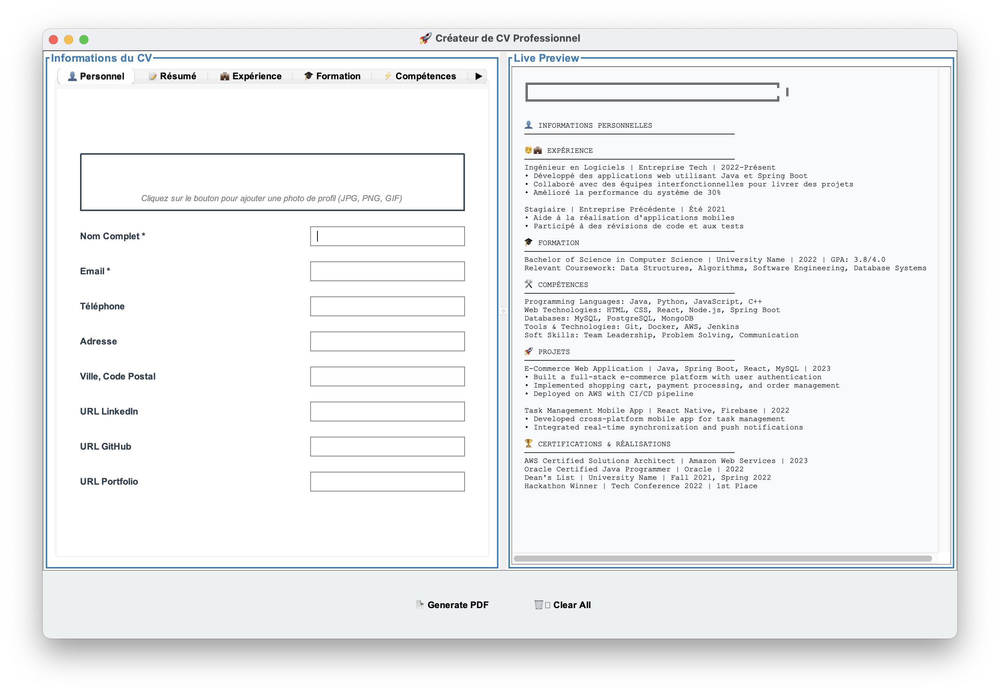
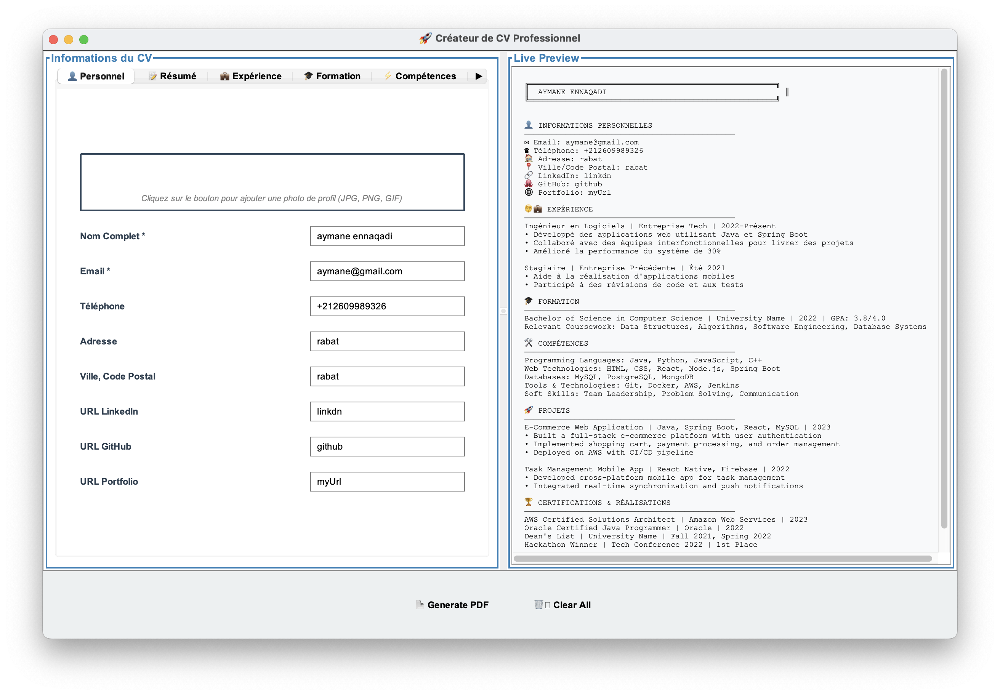
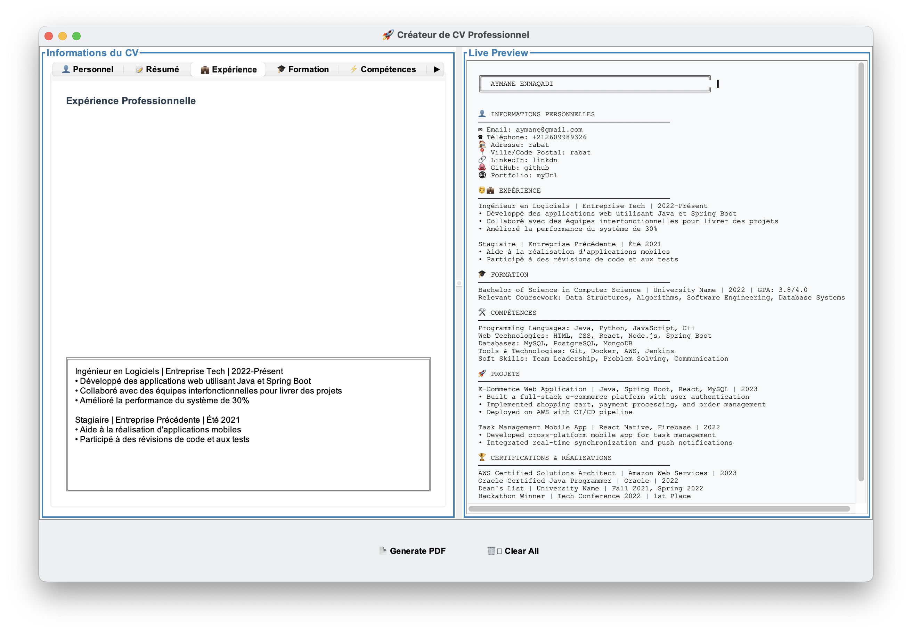
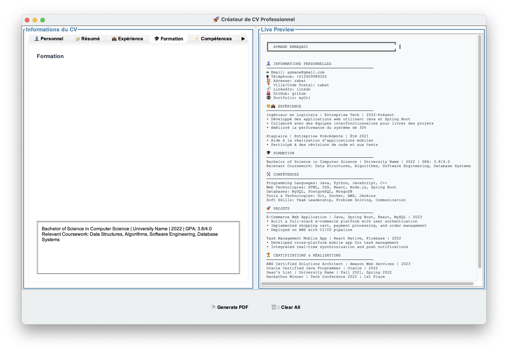
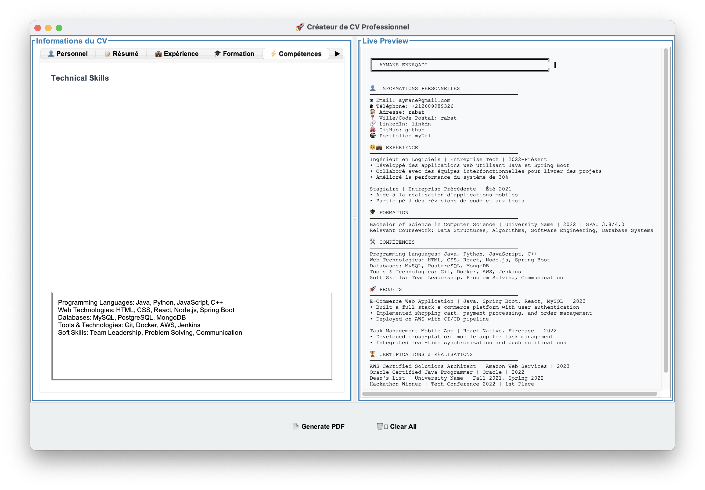
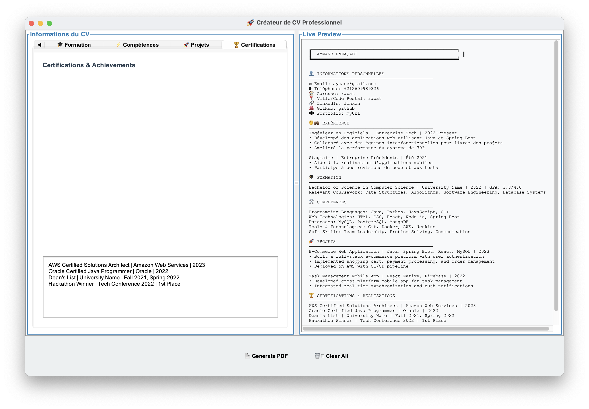
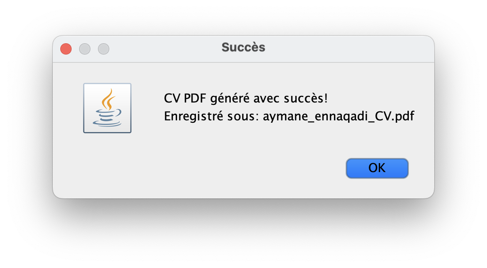
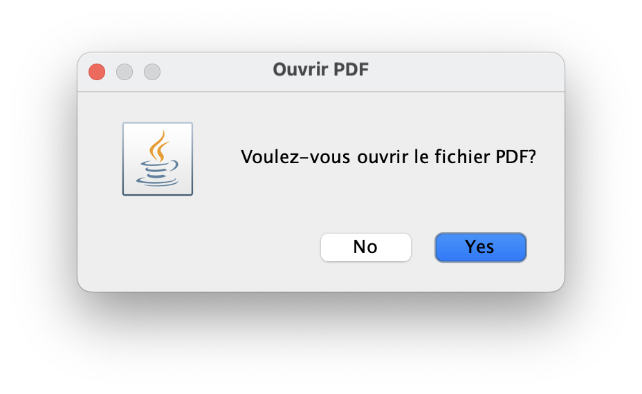
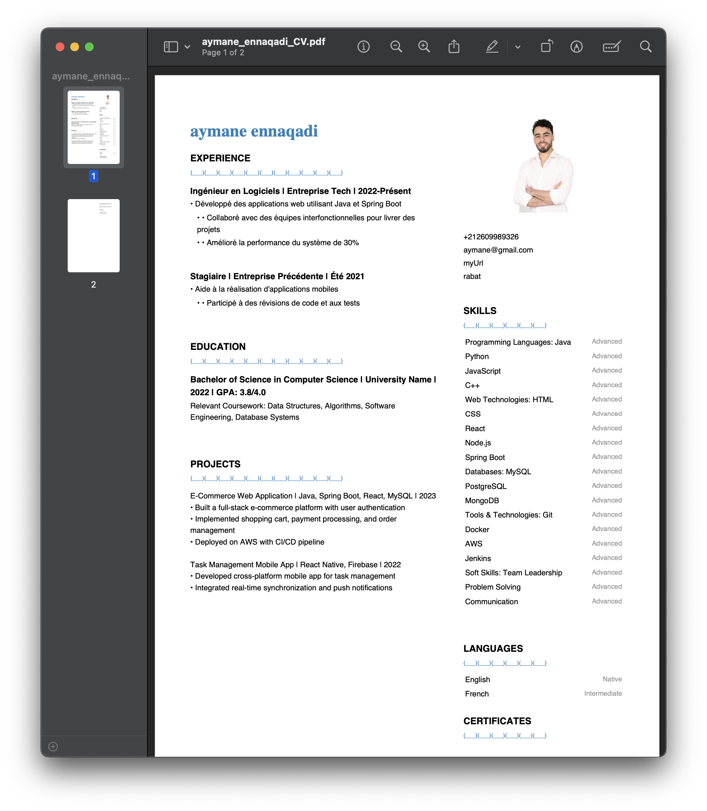

# Resume Builder

A Java application for creating professional resumes using iText PDF library.

## Features

- Create professional PDF resumes
- Customizable templates
- Easy-to-use interface
- Export to PDF format

## How It Works

### 1. Main Interface

*The main window of the Resume Builder application*

The application starts with a clean, organized interface where you can:
- Navigate through different sections using the menu
- See a preview of your resume as you build it
- Access all the tools needed to create your resume

### 2. Personal Information

*Enter your personal details*

In this section, you can add:
- Your full name
- Contact information (email, phone)
- Professional summary
- Social media links
- Location information

### 3. Work Experience

*Add your professional experience*

Add your work history with:
- Company names and positions
- Employment dates
- Key responsibilities and achievements
- Projects and contributions

### 4. Education

*List your educational background*

Include your:
- Degrees and certifications
- Educational institutions
- Graduation dates
- Academic achievements
- Relevant coursework

### 5. Skills

*Highlight your professional skills*

Add your:
- Technical skills
- Soft skills
- Languages
- Tools and technologies
- Professional certifications

### 6. Additional Information

*Include any extra relevant information*

This section allows you to add:
- Awards and achievements
- Volunteer work
- Publications
- Professional memberships
- Other relevant information

### 7. Preview

*Preview your resume before saving*

Review your resume to ensure:
- All information is accurate
- Formatting is consistent
- Sections are properly organized
- No typos or errors

### 8. Save Dialog

*Choose where to save your resume*

Select:
- Save location
- File name
- PDF format options

### 9. Final Resume

*Your professionally formatted PDF resume*

The final PDF features:
- Professional formatting
- Consistent typography
- Clear section organization
- Proper spacing and alignment
- Print-ready quality

## Step-by-Step Guide

1. **Launch the Application**
   - Run the application using `make run`
   - The main interface will appear with input fields for your information

2. **Enter Your Information**
   - Fill in your personal details (name, contact info, etc.)
   - Add your work experience chronologically
   - Include your educational background
   - List your relevant skills and certifications

3. **Generate Resume**
   - Click the "Generate PDF" button
   - Choose where to save your resume
   - The application will create a professionally formatted PDF

4. **Review and Edit**
   - Open the generated PDF to review
   - Make any necessary adjustments in the application
   - Regenerate the PDF as needed

## Prerequisites

- Java Development Kit (JDK)
- iText PDF library

## Setup

### For macOS/Linux Users

1. Clone the repository
2. Make sure you have JDK installed
3. Download the iText PDF library:
   - Download iText PDF 5.5.10 from [Maven Central](https://repo1.maven.org/maven2/com/itextpdf/itextpdf/5.5.10/itextpdf-5.5.10.jar)
   - Create a `lib` directory in the project root if it doesn't exist
   - Place the downloaded JAR file in the `lib` directory

### For Windows Users

1. Clone the repository
2. Install JDK if not already installed:
   - Download JDK from [Oracle's website](https://www.oracle.com/java/technologies/downloads/) or use [OpenJDK](https://adoptium.net/)
   - Add Java to your system PATH
   - Verify installation by running `java -version` in Command Prompt
3. Download the iText PDF library:
   - Download iText PDF 5.5.10 from [Maven Central](https://repo1.maven.org/maven2/com/itextpdf/itextpdf/5.5.10/itextpdf-5.5.10.jar)
   - Create a `lib` directory in the project root if it doesn't exist
   - Place the downloaded JAR file in the `lib` directory
4. Install Make for Windows:
   - Option 1: Install via [Chocolatey](https://chocolatey.org/): `choco install make`
   - Option 2: Install via [GnuWin32](http://gnuwin32.sourceforge.net/packages/make.htm)
   - Option 3: Use [Git Bash](https://git-scm.com/download/win) which includes make

## Building and Running

Use the provided Makefile to build and run the application:

```bash
# Build the project
make build

# Run the application
make run

# Clean compiled files
make clean

# Rebuild and run
make rebuild
```

### Windows-specific Notes

- If you're using Command Prompt or PowerShell, you might need to use `mingw32-make` instead of `make`
- If you're using Git Bash, you can use `make` commands as shown above
- Make sure your system PATH includes both Java and Make executables

## Project Structure

- `src/` - Source code directory
- `lib/` - Library dependencies (place iText PDF JAR here)
- `Makefile` - Build automation
- `docs/images/` - Documentation images and screenshots 