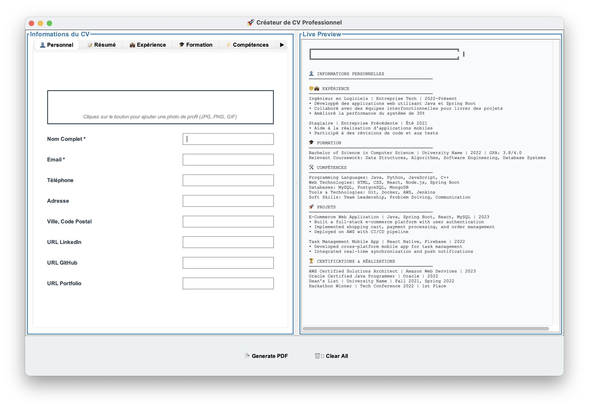
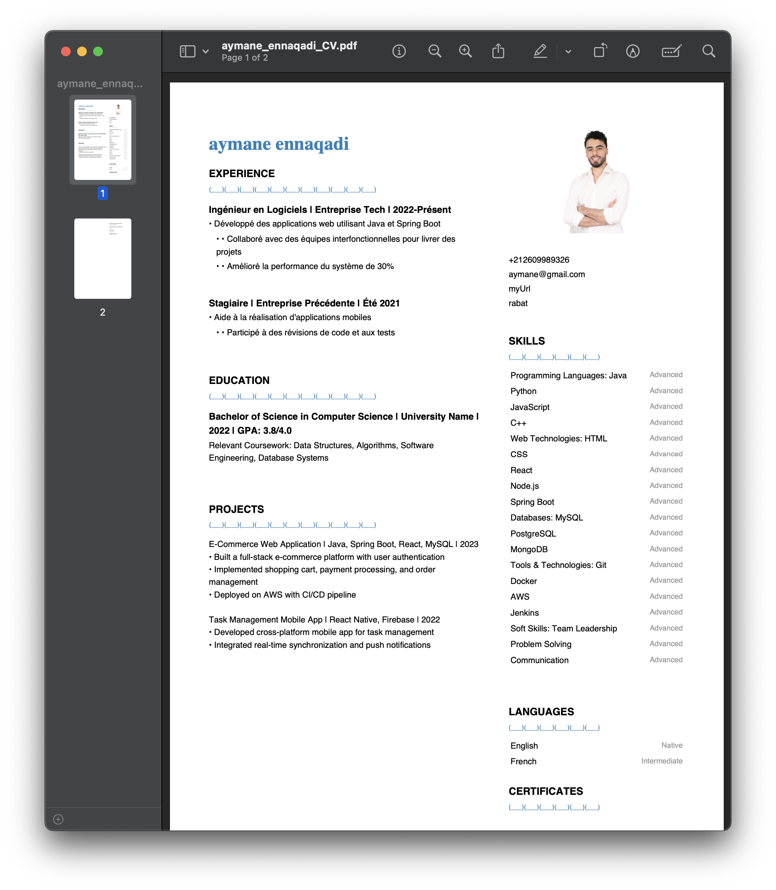

# Resume Builder

A Java application for creating professional resumes using iText PDF library.

## Features

- Create professional PDF resumes
- Customizable templates
- Easy-to-use interface
- Export to PDF format

## How It Works

### Application Interface

*Main interface of the Resume Builder application*

The application provides a user-friendly interface where you can:
1. Enter your personal information in the top section
2. Add your work experience with company details and responsibilities
3. List your education history
4. Include your skills and certifications
5. Add any additional sections as needed

### Sample Resume Output

*Example of a generated resume in PDF format*

The generated PDF resume features:
1. Professional formatting with consistent spacing and typography
2. Clear section organization (Personal Info, Experience, Education, Skills)
3. Proper alignment and hierarchy of information
4. Clean and modern design suitable for professional use

## Step-by-Step Guide

1. **Launch the Application**
   - Run the application using `make run`
   - The main interface will appear with input fields for your information

2. **Enter Your Information**
   - Fill in your personal details (name, contact info, etc.)
   - Add your work experience chronologically
   - Include your educational background
   - List your relevant skills and certifications

3. **Generate Resume**
   - Click the "Generate PDF" button
   - Choose where to save your resume
   - The application will create a professionally formatted PDF

4. **Review and Edit**
   - Open the generated PDF to review
   - Make any necessary adjustments in the application
   - Regenerate the PDF as needed

## Prerequisites

- Java Development Kit (JDK)
- iText PDF library

## Setup

### For macOS/Linux Users

1. Clone the repository
2. Make sure you have JDK installed
3. Download the iText PDF library:
   - Download iText PDF 5.5.10 from [Maven Central](https://repo1.maven.org/maven2/com/itextpdf/itextpdf/5.5.10/itextpdf-5.5.10.jar)
   - Create a `lib` directory in the project root if it doesn't exist
   - Place the downloaded JAR file in the `lib` directory

### For Windows Users

1. Clone the repository
2. Install JDK if not already installed:
   - Download JDK from [Oracle's website](https://www.oracle.com/java/technologies/downloads/) or use [OpenJDK](https://adoptium.net/)
   - Add Java to your system PATH
   - Verify installation by running `java -version` in Command Prompt
3. Download the iText PDF library:
   - Download iText PDF 5.5.10 from [Maven Central](https://repo1.maven.org/maven2/com/itextpdf/itextpdf/5.5.10/itextpdf-5.5.10.jar)
   - Create a `lib` directory in the project root if it doesn't exist
   - Place the downloaded JAR file in the `lib` directory
4. Install Make for Windows:
   - Option 1: Install via [Chocolatey](https://chocolatey.org/): `choco install make`
   - Option 2: Install via [GnuWin32](http://gnuwin32.sourceforge.net/packages/make.htm)
   - Option 3: Use [Git Bash](https://git-scm.com/download/win) which includes make

## Building and Running

Use the provided Makefile to build and run the application:

```bash
# Build the project
make build

# Run the application
make run

# Clean compiled files
make clean

# Rebuild and run
make rebuild
```

### Windows-specific Notes

- If you're using Command Prompt or PowerShell, you might need to use `mingw32-make` instead of `make`
- If you're using Git Bash, you can use `make` commands as shown above
- Make sure your system PATH includes both Java and Make executables

## Project Structure

- `src/` - Source code directory
- `lib/` - Library dependencies (place iText PDF JAR here)
- `Makefile` - Build automation
- `docs/images/` - Documentation images and screenshots 